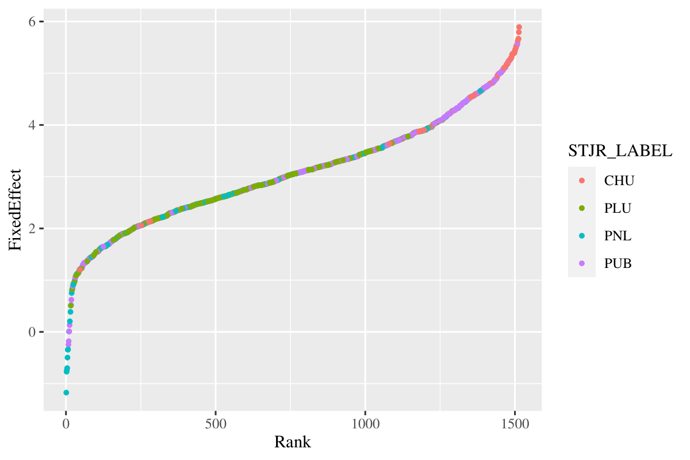
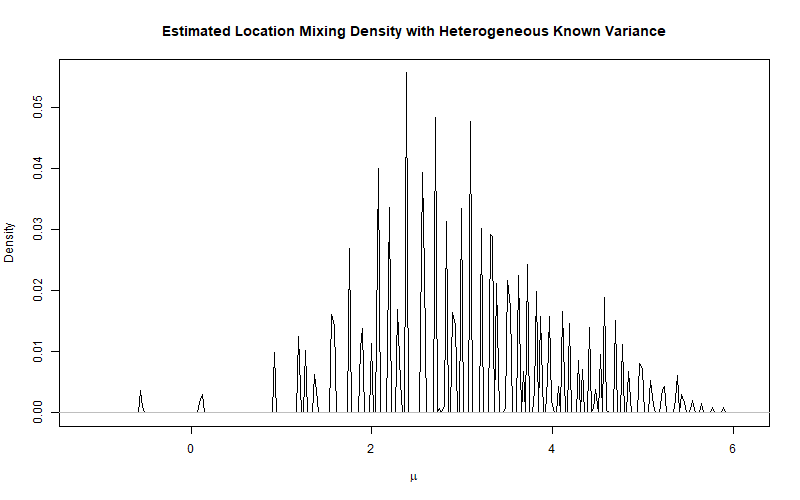
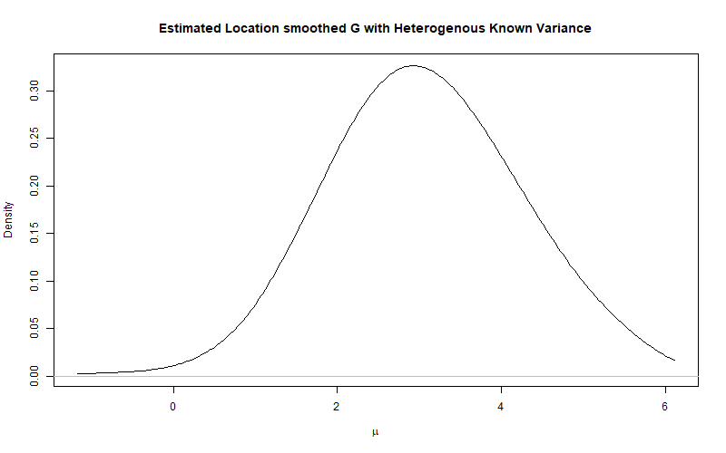
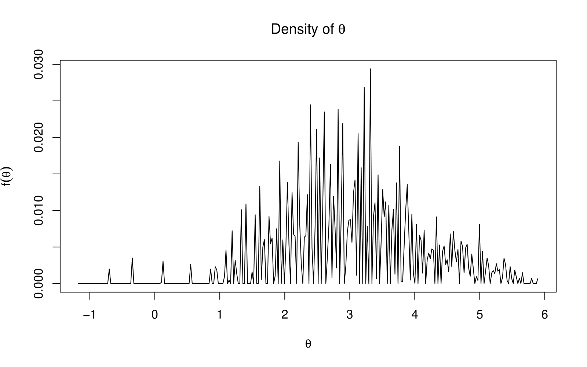
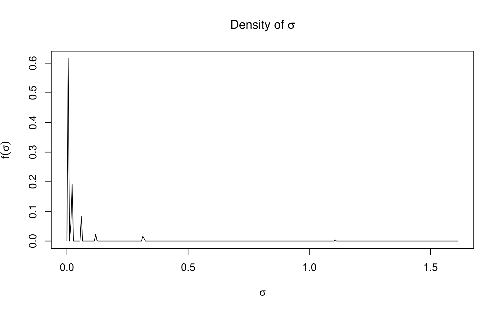
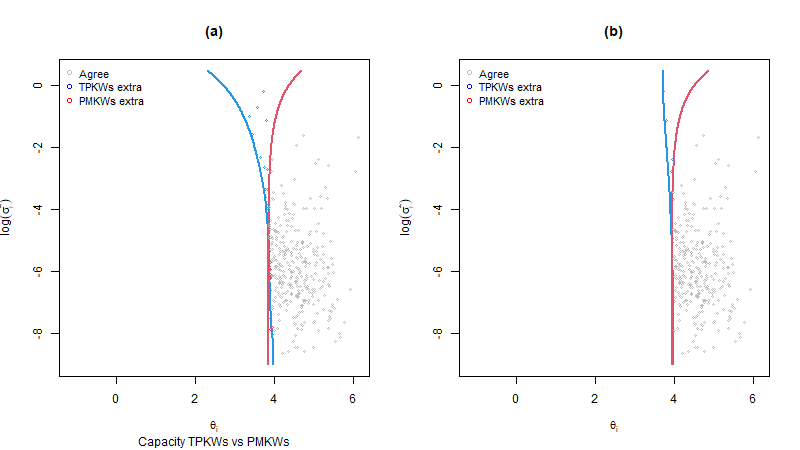
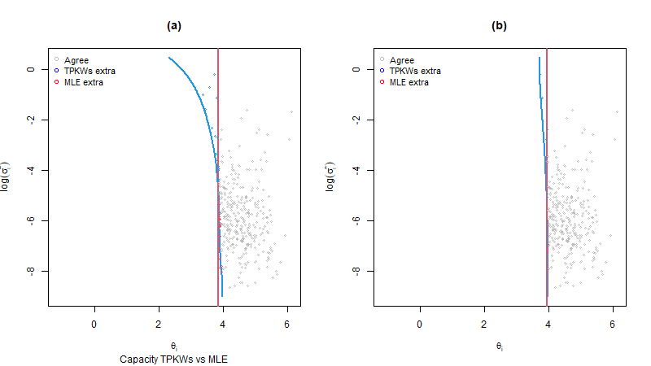
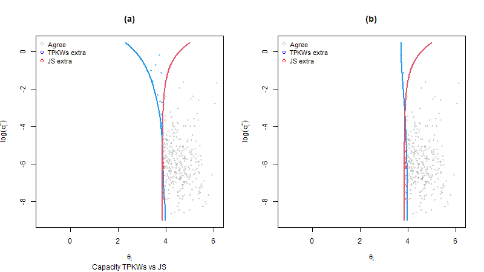

# 2024-06-03

## Regression
$$
\log(y_{it})  =\log(x_{it1})\beta_1+\log(x_{it2})\beta_2+\log(x_{it3})\beta_3+z_{it}\gamma+\log(\theta_i)+\log(\epsilon_{it})
$$ 
Or with an abuse of notation, we can rewrite it as
$$
\log(y_{it})  =\log(x_{it1})\beta_1+\log(x_{it2})\beta_2+\log(x_{it3})\beta_3+z_{it}\gamma+\theta_i+\varepsilon_{it}
$$ 
where $y_{it}$ is the num
ber of full time equivalent registered nurses, $x_{it1}$ is the number of short term acute care (STAC) inpatient stays, $x_{it2}$ is the number of STAC outpatient stays, and $x_{it3}$ is the number of sessions. $z_{it}$ is the CASEMIX index provided by Hospidiag. $\theta_i$ is the fixed effect at the establishment(hospital) level. $\epsilon_{it}$ is the error term.

## Sufficient statistics
Following the discussion in `GilraineMichaelGu2020_TVA`, and relabel everything 
$$
A_{it}^* = X_{it}\beta + \theta_i + \varepsilon_{it} \quad \text{for} \quad i=1,\ldots,n
$$
We have 
$$
A_{it} = A_{it}^*-X_{it}\hat{\beta}=\theta_i + \varepsilon_{it} + X_{it}(\beta-\hat{\beta}) \approx \theta_i + \varepsilon_{it}
$$
where $\hat{\beta}$ is the OLS estimate of $\beta$.  
Thus, averaging over $t$, we have
$$
\bar{A}_i = \frac{\sum_t A_{it}}{T_i} = \theta_i+\varepsilon_{it}+\bar{X}_i(\beta-\hat{\beta}) \approx \theta_i + \bar{\varepsilon}_i \sim N(\theta_i, \frac{\sigma_i^2}{T_i})
$$
We denote $\bar{A}_i$ to be the **sufficient statistic** for $\theta_i$ as in `GuKoenker2017_EmpiricalBayesball`.

Also the **sufficient statistics** for $\sigma_i^2$ is
$$
S_i = \frac{1}{T_i-1}\sum_t (A_{it}-\bar{A}_i+(X_{it}-\bar{X}_i)(\beta-\hat{\beta}))^2 \\
\approx \frac{1}{T_i-1}\sum_t (A_{it}-\bar{A}_i)^2 \sim \gamma(r_i,\frac{\sigma^2}{r_i})
$$ 
where $r_i = (T_i-1)/2$.

## Hierarchy 

### Location mixutre

+ We (boldly) assume that the sufficient statistics $\bar{A}_i$ for $\theta_i$ follow a normal distribution $N(\theta_i,\sigma_i^2/2)$ and the $\theta_i$ follows an unknown distribution $G$ which we aim to estimate.
  
### Scale mixture
+ We assume that the $S_i$ follows a gamma distribution $\gamma(r_i,\sigma_i^2/r_i)$ and the $\sigma_i^2$ follows an unknown distribution $H$ which we aim to estimate.
  
### Location-Scale mixture

+ If we assume that the $\theta_i$ and $\sigma_i^2$ are independent. We need to estimate $G$ and $H$
+ If we assume that the $\theta_i$ and $\sigma_i^2$ are dependent. We need to estimate $G(\theta_i,\sigma_i^2)$ jointly.

## Compound decision (borrowing strength from the ensemble $G$)
### Posterior mean 
As shown in `GuKoenker2023_CompoundDecision`, if we assume $N$ to be normal, and $G$ is the prior distribution of $\theta_i$, we have the **Tweedie formula**:
$$
t_G(Y)= E(\alpha|Y) = \frac{\int \alpha \phi(Y-\alpha)dG(\alpha)}{\int \phi(Y-\alpha)dG(\alpha)}\\
= Y+\frac{f'(Y)}{f(Y)}
$$
where $f(Y) = \int \phi(Y-\alpha)dG(\alpha)$ and $\phi$ is the standard normal density function.

Linear shrinkage is a special case of the James-Stein shrinkage. While James-steing shrinkage is a special case of G being **normal**.

However we can non-parametrically estimate $G$ following the contribution of `KoenkerMizeria2014` by utilizing the `MOSEK` package in convex optimization.

### Posterior tail probability
This is a natural criterion when we consider the ***selection*** problem. We want to select the top(R)/bottom(L) $\alpha\%$ of the individual $\theta_i$.   
For example, for the **right tail selection** of $\alpha\%$, we define $\theta_\alpha = G(1-\alpha)$ to be the $1-\alpha$ quantile of $G$. We want to select the $\theta_i$ such that $\theta_i > \theta_\alpha$ given the observed $\bar{A}_i$ and $S_i$.

This requires the an estimate of $G$. We will use KW and KWsmooth to estimate $G$.

### MLE
Take the face value of $\bar{A}_i$ and perform the selection.

### Linear
A special case of posterior mean but with G estimated parametrically (normal) instead of non-parametrically.

We will compare the 4 rules in terms of the selection results.

## Results of $G$ and ($H$)

### Homogeneous variance
Not implemented: To test the procedure, we can pool all $S_i$ together and estimate the universal $\sigma^2$ for all $N(\theta_i,\sigma^2)$.
### Heterogeneous known variance
Implemented: For simplicity and to test the the procedure, we first assume that the $\sigma_i^2$ is known and we set it to the sufficient statistics $S_i$.

### Heterogeneous unknown variance
The location mixture $G$

The scale mixture $H$

## Results of selection

### Hetereogeneous known variance
Implemented: For simplicity and to test the the procedure, we first assume that the $\sigma_i^2$ is known and we set it to the sufficient statistics $S_i.
If we set the **capacity constraint** to be the top 20%. the False Discovery Rate constraint to be 0.05. We have the following results:

If we ignore the FDR constraint when performing selection subject to capacity constraint only, we have the following results:

|             | $\alpha=4\%$ | $\alpha=10\%$ | $\alpha=15\%$ | $\alpha=20\%$ | $\alpha=25\%$ |
| ----------- | ------------ | ------------- | ------------- | ------------- | ------------- |
| TP          | 0.39         | 0.17          | 0.11          | 0.13          | 0.12          |
| PM          | 0.40         | 0.18          | 0.11          | 0.13          | 0.13          |
| MLE         | 0.40         | 0.18          | 0.11          | 0.13          | 0.13          |
| James-Stein | 0.40         | 0.18          | 0.11          | 0.14          | 0.13          |

### Heterogeneous unknown variance
To be figured out.

## Completed
+ Extended the data from 2013-2022.
+ Estimated the $\hat{G}$ and $\hat{H}$. 
+ Implemented the selection procedure for the heterogeneous known variance case.
+ Estimate the false discovery rate.

## Next steps
+ Implement the selection procedure for the heterogeneous unknown variance case.
+ Identify the selected institutions and classify them into different legal categories.
+ Explore other specifications of the regression model. (other regressors, other functional forms, other dependent variables, etc.)
+ Conclusion that may seem interesting (?).

## Issues
1. The variance is so small that setting FDR to be 0.2 is not a binding constraint. Unlike the kidney dialysis example in the `GuKoenker2023_CompoundDecision` paper.
2. The estimated $\bar{A}_i$ is very noisy. This is due to the very short time span of the data.
3. Justify the efficiency measure using the number of registered nurses. Also explore the use of medical doctors.
4. Input demand function or Production function to estimate the efficiency/fixed effect of the hospitals.
5. To what extent can we interpret the fixed effect as efficiency?