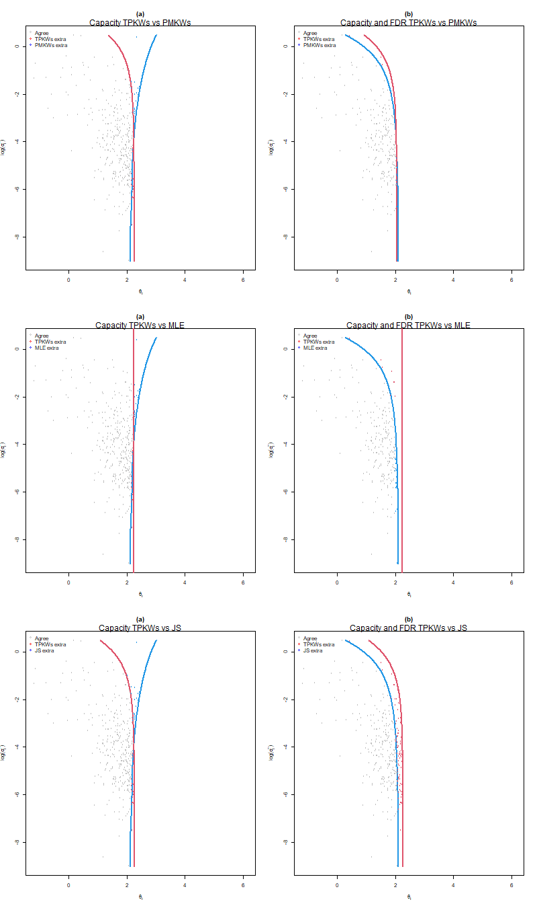
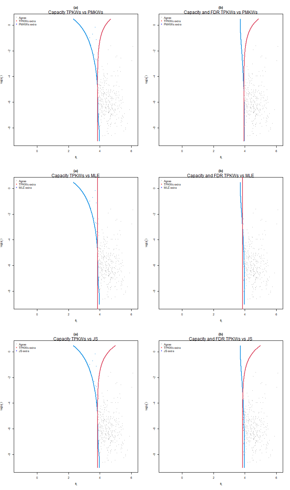
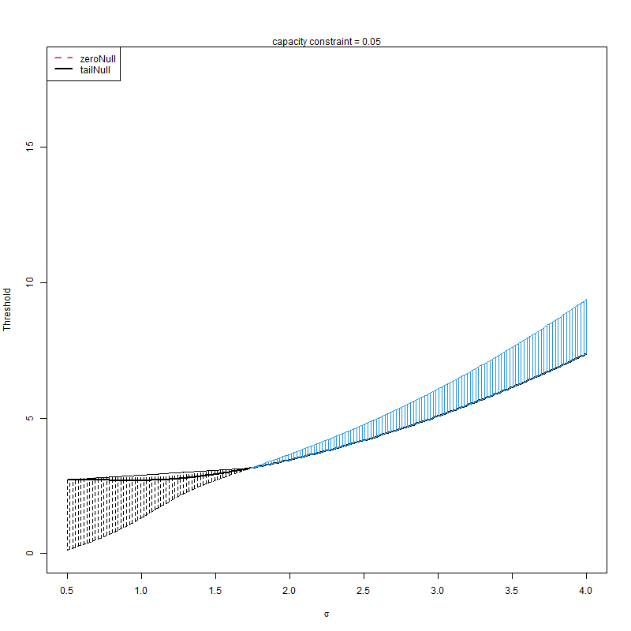
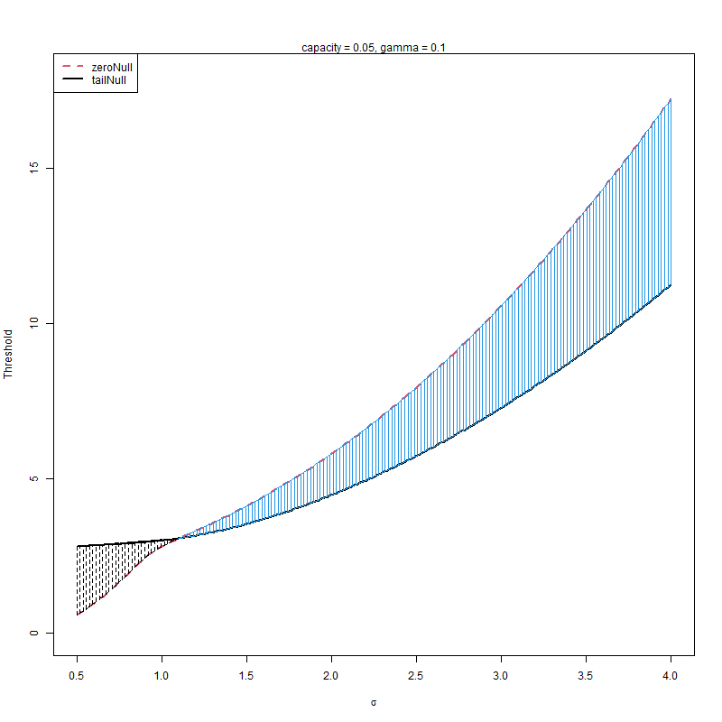

# 2024-06-04

## Selection comparison

We set capacity constraint $\alpha=0.22$ and FDR constraint $\gamma = 0.05$. We compare the selection of the following methods:
1. TPKWs and PMKWs
2. TPKWs and MLE
3. TPKWs and JS(linear)

### Left tail selection result



###  Right tail selection result



## Separate G 

### Idea 1: 

#### Step 1: estimate G separately
Following `Walter2022nber`, it is possible to estimate $G$ while incorporating the covariates. The simplest case is when the covariate is just dummy variable, which means we estimate two different distributions for each group (standard vs charter, public vs private, etc.).

Following `KlineRoseWalter2022`, we can estimate two distributions for estimates $({\hat{\theta}})$ with high $(s_h)$ vs low precision $(s_l)$.

##### Step 2: aggregate G

Following `KlineRoseWalter2022`, a possible way to obtain the marginal distribution is to aggregate $G_1$ and $G_2$ by taking average.
> The marginal density is compute as the average of the group-specific densities.

Maybe we can weighted by the size of each group in computing the marginal $G$

#### Step 3: Same as before

Proceed as usual in defining tail probability etc. 

### Idea 2

If we do not aggregate, can we compute tail probability?   
The tail is not obvious here since previously 
$$ \theta_\alpha = G(1-\alpha)
$$
We only have a capacity constraint over the total number of selection but not for each group. As shown in `GuKoenker2023`, different tail $\theta_\alpha$ can lead to different ranking statistics $v_\alpha(y)$. Different ranking statistics will affect the calculation of **local False discovery rate**.  

Yet if we only impose capacity constraint, the ranking statistics won't matter. ranking will be the same regardless of whether we use 
$v_{\alpha_1}(y)$ or $v_{\alpha_2}(y)$.

But FDR depends on both on **ranking statistics** $T(y)$ and **tail probability** $v_\alpha(y)$.
```r
function (lambda, stat, v)
{
    mean((1 - v) * (stat > lambda))/mean(stat > lambda)
} 
```
To deal with the issue of selecting $\alpha$ for each group, we can 
1. Use a common $\alpha_0$ to define the tail $v_{\alpha_0}(y)$. 
3. Given the posterior tail probability $v_{\alpha_0}(y)$ for all $i$ as the **ranking statistics**, perform the selection based on the ranking statistics $v_{\alpha_0}(y)$ such that capacity constraint is satisfied. 
4. See how many $i$ are selected in each group is selected and update the $\alpha_0$ to individual group specific $\alpha_i$.
5. For each group, find the threshold $\lambda_{1i}$ that satisfy the LFdr constraint using the tail probability $v_{\alpha_i}(y)$.


## Issues

Conventional and capacity dependent null rules do not give the same selection result.






## Regression results

### with less covariates
|                                                       | Within\-group | Within\-group \(GLS\) | First difference | First difference \(GLS\) |
| ----------------------------------------------------- | ------------- | --------------------- | ---------------- | ------------------------ |
| log\(SEJHC\_MCO\)                                     | 0\.1283\*\*\* | 0\.1088\*\*\*         | 0\.1136\*\*\*    | 0\.1063\*\*\*            |
|                                                       | \(0\.0238\)   | \(0\.0059\)           | \(0\.0207\)      | \(0\.0059\)              |
| log\(SEJHP\_MCO\)                                     | 0\.0307\*\*\* | 0\.0212\*\*\*         | 0\.0226\*\*\*    | 0\.0206\*\*\*            |
|                                                       | \(0\.0083\)   | \(0\.0024\)           | \(0\.0063\)      | \(0\.0024\)              |
| log\(SEANCES\_MED\)                                   | 0\.0308\*\*\* | 0\.0245\*\*\*         | 0\.0239\*\*\*    | 0\.0216\*\*\*            |
|                                                       | \(0\.0042\)   | \(0\.0023\)           | \(0\.0046\)      | \(0\.0021\)              |
| CASEMIX                                               | 0\.0021\*\*   | 0\.0007               | 0\.0007          | 0\.0007                  |
|                                                       | \(0\.0007\)   | \(0\.0004\)           | \(0\.0006\)      | \(0\.0004\)              |
| R2                                                    | 0\.1145       | 0\.9910               | 0\.0692          | 0\.9907                  |
| Num\. obs\.                                           | 9038          | 9038                  | 7554             | 7554                     |
| \*\*\*p &lt; 0\.001; \*\*p &lt; 0\.01; \*p &lt; 0\.05 |

### with more covariates
|                                                       | Within\-group | Within\-group \(GLS\) | First difference | First difference \(GLS\) |
| ----------------------------------------------------- | ------------- | --------------------- | ---------------- | ------------------------ |
| log\(SEJHC\_MCO\)                                     | 0\.1262\*\*\* | 0\.1072\*\*\*         | 0\.1122\*\*\*    | 0\.1049\*\*\*            |
|                                                       | \(0\.0234\)   | \(0\.0059\)           | \(0\.0200\)      | \(0\.0059\)              |
| log\(SEJHP\_MCO\)                                     | 0\.0198\*\*   | 0\.0135\*\*\*         | 0\.0152\*\*      | 0\.0128\*\*\*            |
|                                                       | \(0\.0073\)   | \(0\.0027\)           | \(0\.0054\)      | \(0\.0027\)              |
| log\(SEANCES\_MED\)                                   | 0\.0294\*\*\* | 0\.0239\*\*\*         | 0\.0232\*\*\*    | 0\.0215\*\*\*            |
|                                                       | \(0\.0041\)   | \(0\.0023\)           | \(0\.0045\)      | \(0\.0021\)              |
| log\(PASSU\)                                          | 0\.0019       | 0\.0024               | \-0\.0003        | 0\.0017                  |
|                                                       | \(0\.0043\)   | \(0\.0043\)           | \(0\.0035\)      | \(0\.0043\)              |
| log\(VEN\_TOT\)                                       | 0\.0106\*     | 0\.0075\*             | 0\.0039          | 0\.0024                  |
|                                                       | \(0\.0041\)   | \(0\.0031\)           | \(0\.0031\)      | \(0\.0030\)              |
| log\(SEJ\_HTP\_TOT\)                                  | 0\.0224\*\*   | 0\.0233\*\*\*         | 0\.0158\*        | 0\.0182\*\*\*            |
|                                                       | \(0\.0084\)   | \(0\.0053\)           | \(0\.0066\)      | \(0\.0054\)              |
| log\(PLA\_MCO\)                                       | 0\.0472\*\*   | 0\.0409\*\*\*         | 0\.0416\*\*      | 0\.0424\*\*\*            |
|                                                       | \(0\.0182\)   | \(0\.0067\)           | \(0\.0161\)      | \(0\.0067\)              |
| CANCER                                                | 0\.0018       | 0\.0015\*             | 0\.0017          | 0\.0015\*\*              |
|                                                       | \(0\.0012\)   | \(0\.0006\)           | \(0\.0009\)      | \(0\.0006\)              |
| CASEMIX                                               | 0\.0020\*\*   | 0\.0008               | 0\.0008          | 0\.0007                  |
|                                                       | \(0\.0007\)   | \(0\.0004\)           | \(0\.0006\)      | \(0\.0004\)              |
| R2                                                    | 0\.1267       | 0\.9911               | 0\.0761          | 0\.9908                  |
| Num\. obs\.                                           | 9038          | 9038                  | 7554             | 7554                     |
| \*\*\*p &lt; 0\.001; \*\*p &lt; 0\.01; \*p &lt; 0\.05 |


### With more covariates and interaction terms

|                                                       | Within\-group | Within\-group \(GLS\) | First difference | First difference \(GLS\) |
| ----------------------------------------------------- | ------------- | --------------------- | ---------------- | ------------------------ |
| log\(SEJHC\_MCO\)                                     | 0\.1256\*\*\* | 0\.1071\*\*\*         | 0\.1124\*\*\*    | 0\.1049\*\*\*            |
|                                                       | \(0\.0231\)   | \(0\.0059\)           | \(0\.0196\)      | \(0\.0059\)              |
| log\(SEJHP\_MCO\)                                     | 0\.0201\*\*   | 0\.0142\*\*\*         | 0\.0159\*\*      | 0\.0135\*\*\*            |
|                                                       | \(0\.0073\)   | \(0\.0027\)           | \(0\.0055\)      | \(0\.0027\)              |
| log\(SEANCES\_MED\)                                   | 0\.0292\*\*\* | 0\.0237\*\*\*         | 0\.0229\*\*\*    | 0\.0213\*\*\*            |
|                                                       | \(0\.0041\)   | \(0\.0023\)           | \(0\.0044\)      | \(0\.0021\)              |
| log\(PASSU\)                                          | 0\.0021       | 0\.0021               | \-0\.0002        | 0\.0015                  |
|                                                       | \(0\.0043\)   | \(0\.0043\)           | \(0\.0034\)      | \(0\.0043\)              |
| log\(VEN\_TOT\)                                       | 0\.0106\*\*   | 0\.0075\*             | 0\.0039          | 0\.0024                  |
|                                                       | \(0\.0041\)   | \(0\.0031\)           | \(0\.0031\)      | \(0\.0029\)              |
| log\(SEJ\_HTP\_TOT\)                                  | 0\.0220\*\*   | 0\.0231\*\*\*         | 0\.0158\*        | 0\.0182\*\*\*            |
|                                                       | \(0\.0084\)   | \(0\.0053\)           | \(0\.0065\)      | \(0\.0054\)              |
| log\(PLA\_MCO\)                                       | 0\.0673\*     | 0\.0616\*\*\*         | 0\.0656\*\*      | 0\.0637\*\*\*            |
|                                                       | \(0\.0264\)   | \(0\.0080\)           | \(0\.0234\)      | \(0\.0081\)              |
| CANCER                                                | 0\.0018       | 0\.0015\*\*           | 0\.0017\*        | 0\.0016\*\*              |
|                                                       | \(0\.0012\)   | \(0\.0006\)           | \(0\.0009\)      | \(0\.0006\)              |
| CASEMIX                                               | 0\.0027\*\*   | 0\.0013\*\*           | 0\.0014          | 0\.0013\*\*              |
|                                                       | \(0\.0009\)   | \(0\.0004\)           | \(0\.0007\)      | \(0\.0004\)              |
| log\(PLA\_MCO\):CASEMIX                               | \-0\.0013     | \-0\.0013\*\*\*       | \-0\.0015\*      | \-0\.0013\*\*\*          |
|                                                       | \(0\.0007\)   | \(0\.0003\)           | \(0\.0007\)      | \(0\.0003\)              |
| R2                                                    | 0\.1291       | 0\.9911               | 0\.0797          | 0\.9908                  |
| Num\. obs\.                                           | 9038          | 9038                  | 7554             | 7554                     |
| \*\*\*p &lt; 0\.001; \*\*p &lt; 0\.01; \*p &lt; 0\.05 |
